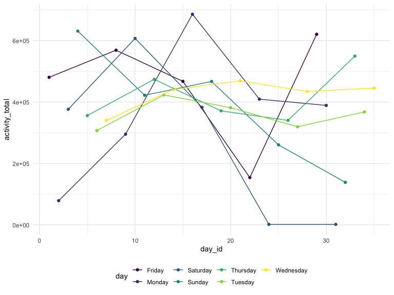
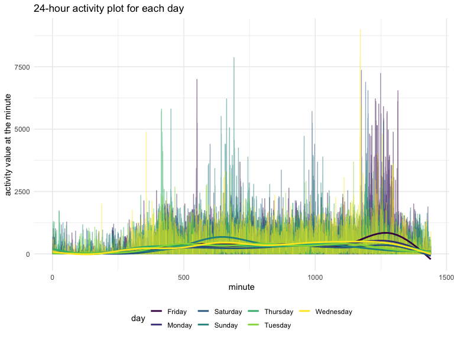
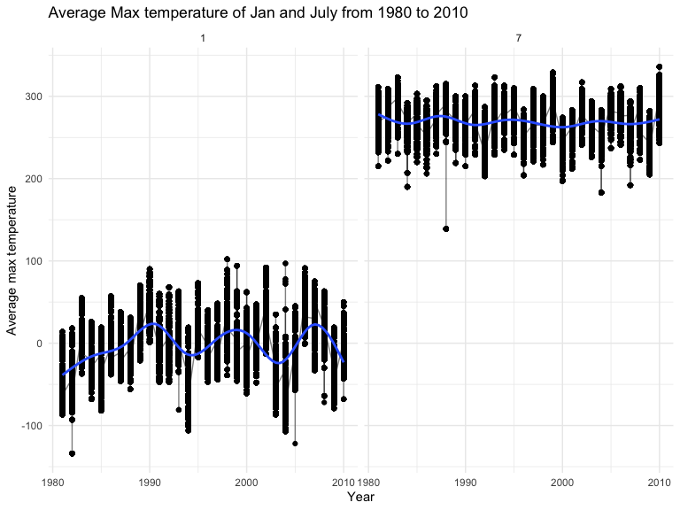
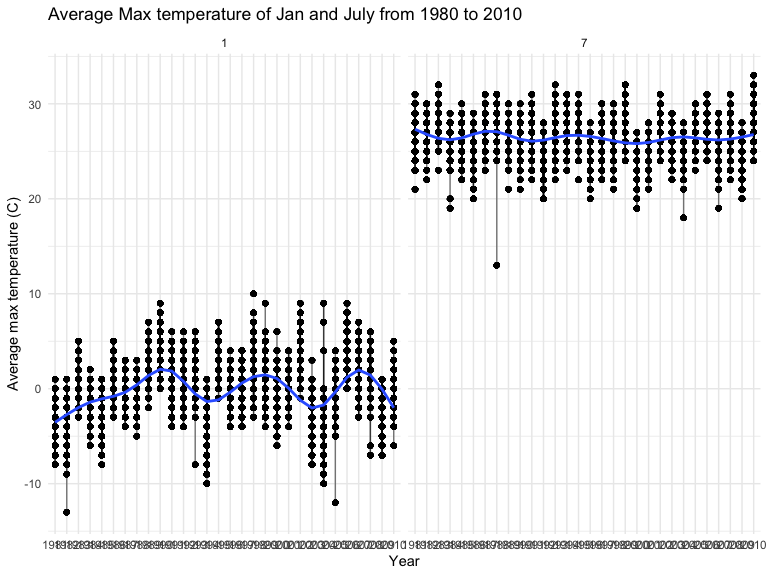
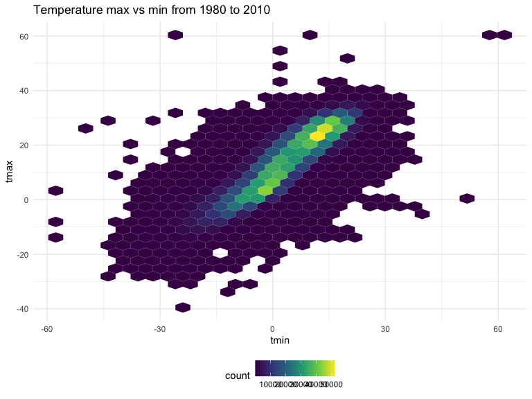

p8105_hw3_jy3186
================
Jiayi Yang
2022-10-11

``` r
library(tidyverse)
```

    ## ── Attaching packages ─────────────────────────────────────── tidyverse 1.3.2 ──
    ## ✔ ggplot2 3.3.6      ✔ purrr   0.3.4 
    ## ✔ tibble  3.1.8      ✔ dplyr   1.0.10
    ## ✔ tidyr   1.2.0      ✔ stringr 1.4.1 
    ## ✔ readr   2.1.2      ✔ forcats 0.5.2 
    ## ── Conflicts ────────────────────────────────────────── tidyverse_conflicts() ──
    ## ✖ dplyr::filter() masks stats::filter()
    ## ✖ dplyr::lag()    masks stats::lag()

``` r
library(dplyr)
library(rnoaa)
```

    ## Registered S3 method overwritten by 'hoardr':
    ##   method           from
    ##   print.cache_info httr

``` r
library(ggridges)
library(patchwork)
library(p8105.datasets)
```

\##Problem 1 from Jeff’s solution

### Due date

Due: October 15 at 11:59pm.

### Points

| Problem         | Points    |
|:----------------|:----------|
| Problem 0       | 20        |
| Problem 1       | –         |
| Problem 2       | 40        |
| Problem 3       | 40        |
| Optional survey | No points |

### Problem 0

This solution focuses on a reproducible report containing code and text
necessary for Problems 1-3, and is organized as an R Project. This was
not prepared as a GitHub repo; examples for repository structure and git
commits should be familiar from other elements of the course.

Throughout, we use appropriate text to describe our code and results,
and use clear styling to ensure code is readable.

### Problem 1

#### Read in the data

``` r
data("instacart")

instacart = 
  instacart %>% 
  as_tibble(instacart)
```

#### Answer questions about the data

This dataset contains 1384617 rows and 15 columns, with each row
resprenting a single product from an instacart order. Variables include
identifiers for user, order, and product; the order in which each
product was added to the cart. There are several order-level variables,
describing the day and time of the order, and number of days since prior
order. Then there are several item-specific variables, describing the
product name (e.g. Yogurt, Avocado), department (e.g. dairy and eggs,
produce), and aisle (e.g. yogurt, fresh fruits), and whether the item
has been ordered by this user in the past. In total, there are 39123
products found in 131209 orders from 131209 distinct users.

Below is a table summarizing the number of items ordered from aisle. In
total, there are 134 aisles, with fresh vegetables and fresh fruits
holding the most items ordered by far.

``` r
instacart %>% 
  count(aisle) %>% 
  arrange(desc(n))
```

    ## # A tibble: 134 × 2
    ##    aisle                              n
    ##    <chr>                          <int>
    ##  1 fresh vegetables              150609
    ##  2 fresh fruits                  150473
    ##  3 packaged vegetables fruits     78493
    ##  4 yogurt                         55240
    ##  5 packaged cheese                41699
    ##  6 water seltzer sparkling water  36617
    ##  7 milk                           32644
    ##  8 chips pretzels                 31269
    ##  9 soy lactosefree                26240
    ## 10 bread                          23635
    ## # … with 124 more rows

Next is a plot that shows the number of items ordered in each aisle.
Here, aisles are ordered by ascending number of items.

``` r
instacart %>% 
  count(aisle) %>% 
  filter(n > 10000) %>% 
  mutate(aisle = fct_reorder(aisle, n)) %>% 
  ggplot(aes(x = aisle, y = n)) + 
  geom_point() + 
  labs(title = "Number of items ordered in each aisle") +
  theme(axis.text.x = element_text(angle = 60, hjust = 1))
```


Our next table shows the three most popular items in aisles
`baking ingredients`, `dog food care`, and `packaged vegetables fruits`,
and includes the number of times each item is ordered in your table.

``` r
instacart %>% 
  filter(aisle %in% c("baking ingredients", "dog food care", "packaged vegetables fruits")) %>%
  group_by(aisle) %>% 
  count(product_name) %>% 
  mutate(rank = min_rank(desc(n))) %>% 
  filter(rank < 4) %>% 
  arrange(desc(n)) %>%
  knitr::kable()
```

| aisle                      | product_name                                  |    n | rank |
|:---------------------------|:----------------------------------------------|-----:|-----:|
| packaged vegetables fruits | Organic Baby Spinach                          | 9784 |    1 |
| packaged vegetables fruits | Organic Raspberries                           | 5546 |    2 |
| packaged vegetables fruits | Organic Blueberries                           | 4966 |    3 |
| baking ingredients         | Light Brown Sugar                             |  499 |    1 |
| baking ingredients         | Pure Baking Soda                              |  387 |    2 |
| baking ingredients         | Cane Sugar                                    |  336 |    3 |
| dog food care              | Snack Sticks Chicken & Rice Recipe Dog Treats |   30 |    1 |
| dog food care              | Organix Chicken & Brown Rice Recipe           |   28 |    2 |
| dog food care              | Small Dog Biscuits                            |   26 |    3 |

Finally is a table showing the mean hour of the day at which Pink Lady
Apples and Coffee Ice Cream are ordered on each day of the week. This
table has been formatted in an untidy manner for human readers. Pink
Lady Apples are generally purchased slightly earlier in the day than
Coffee Ice Cream, with the exception of day 5.

``` r
instacart %>%
  filter(product_name %in% c("Pink Lady Apples", "Coffee Ice Cream")) %>%
  group_by(product_name, order_dow) %>%
  summarize(mean_hour = mean(order_hour_of_day)) %>%
  spread(key = order_dow, value = mean_hour) %>%
  knitr::kable(digits = 2)
```

    ## `summarise()` has grouped output by 'product_name'. You can override using the
    ## `.groups` argument.

| product_name     |     0 |     1 |     2 |     3 |     4 |     5 |     6 |
|:-----------------|------:|------:|------:|------:|------:|------:|------:|
| Coffee Ice Cream | 13.77 | 14.32 | 15.38 | 15.32 | 15.22 | 12.26 | 13.83 |
| Pink Lady Apples | 13.44 | 11.36 | 11.70 | 14.25 | 11.55 | 12.78 | 11.94 |

\##Problem 2 load and tidy the data

``` r
accel_data = read_csv("./accel_data.csv") %>% 
  janitor::clean_names() %>% 
  mutate(
    weekday_weekend = ifelse(day %in% c("Saturday","Sunday"), "Weekend", "Weekday"),
    day_id = as.integer(day_id),
    week = as.integer(week)
  ) %>% 
  relocate(weekday_weekend)
```

    ## Rows: 35 Columns: 1443
    ## ── Column specification ────────────────────────────────────────────────────────
    ## Delimiter: ","
    ## chr    (1): day
    ## dbl (1442): week, day_id, activity.1, activity.2, activity.3, activity.4, ac...
    ## 
    ## ℹ Use `spec()` to retrieve the full column specification for this data.
    ## ℹ Specify the column types or set `show_col_types = FALSE` to quiet this message.

``` r
accel_data
```

    ## # A tibble: 35 × 1,444
    ##    weekday_…¹  week day_id day   activ…² activ…³ activ…⁴ activ…⁵ activ…⁶ activ…⁷
    ##    <chr>      <int>  <int> <chr>   <dbl>   <dbl>   <dbl>   <dbl>   <dbl>   <dbl>
    ##  1 Weekday        1      1 Frid…    88.4    82.2    64.4    70.0    75.0    66.3
    ##  2 Weekday        1      2 Mond…     1       1       1       1       1       1  
    ##  3 Weekend        1      3 Satu…     1       1       1       1       1       1  
    ##  4 Weekend        1      4 Sund…     1       1       1       1       1       1  
    ##  5 Weekday        1      5 Thur…    47.4    48.8    46.9    35.8    49.0    44.8
    ##  6 Weekday        1      6 Tues…    64.8    59.5    73.7    45.7    42.4    58.4
    ##  7 Weekday        1      7 Wedn…    71.1   103.     68.5    45.4    37.8    18.3
    ##  8 Weekday        2      8 Frid…   675     542    1010     779     509     106  
    ##  9 Weekday        2      9 Mond…   291     335     393     335     263     675  
    ## 10 Weekend        2     10 Satu…    64      11       1       1       1       1  
    ## # … with 25 more rows, 1,434 more variables: activity_7 <dbl>,
    ## #   activity_8 <dbl>, activity_9 <dbl>, activity_10 <dbl>, activity_11 <dbl>,
    ## #   activity_12 <dbl>, activity_13 <dbl>, activity_14 <dbl>, activity_15 <dbl>,
    ## #   activity_16 <dbl>, activity_17 <dbl>, activity_18 <dbl>, activity_19 <dbl>,
    ## #   activity_20 <dbl>, activity_21 <dbl>, activity_22 <dbl>, activity_23 <dbl>,
    ## #   activity_24 <dbl>, activity_25 <dbl>, activity_26 <dbl>, activity_27 <dbl>,
    ## #   activity_28 <dbl>, activity_29 <dbl>, activity_30 <dbl>, …

There are 35 observations and 1444 variables. There are four date
variables `weekday_weekend`, `week`, `day_id` and `day`; and 1440
variables of activity observations.

aggregate activities and make a plot to show the trend

``` r
accel_data %>% 
  group_by(day_id) %>% 
  mutate(
    activity_total =  sum(across(activity_1:activity_1440), na.rm = TRUE),
    activity_total = as.integer(activity_total)
  ) %>% 
  select(week, day, day_id, activity_total) %>% 
  ggplot(aes(x = day_id, y = activity_total, color = day)) + 
    geom_point() + geom_line() + 
    theme(legend.position = "bottom")
```


Make a single-panel plot that shows the 24-hour activity time courses
for each day

``` r
accel_eachday = accel_data %>% 
  select(day_id, day, week, activity_1:activity_1440) %>% 
  pivot_longer(activity_1:activity_1440, names_to = "activity_min", values_to = "activity_value") %>% 
  separate(activity_min, c( NA, "activity"), sep = "_") %>% 
  mutate(
    activity = as.integer(activity),
    activity_value = as.integer(activity_value)
  ) %>% 
  ggplot(aes(x = activity, y = activity_value, color = day), se = FALSE) + 
  geom_line(alpha = .5) + geom_smooth(aes(group = day), se = FALSE) +
    labs(
    title = "24-hour activity plot for each day",
    x = "minute",
    y = "activity value at the minute"
  ) + 
    theme(legend.position = "bottom")
accel_eachday
```

    ## `geom_smooth()` using method = 'gam' and formula 'y ~ s(x, bs = "cs")'


\##Problem 3 load data from web

``` r
library(p8105.datasets)
data("ny_noaa")
ny_noaa_df = 
  ny_noaa %>%
 mutate(
    tmax = as.integer(tmax),
    tmin = as.integer(tmin)
  ) %>% 
  drop_na(tmax, tmin) %>% 
  separate(date, into = c("year", "month", "day"), sep = "-") %>% 
  mutate(
    month = as.integer(month),
    day = as.integer(day)
  )
ny_noaa_df
```

    ## # A tibble: 1,458,900 × 9
    ##    id          year  month   day  prcp  snow  snwd  tmax  tmin
    ##    <chr>       <chr> <int> <int> <int> <int> <int> <int> <int>
    ##  1 USC00300023 1981      1     3     0     0     0  -122  -206
    ##  2 USC00300023 1981      1     5     0     0     0   -56  -178
    ##  3 USC00300023 1981      1    12     0     0     0  -122  -306
    ##  4 USC00300023 1981      1    13     0     0     0   -67  -289
    ##  5 USC00300023 1981      1    15     0     0     0   -50  -106
    ##  6 USC00300023 1981      1    17     0     0     0   -11  -150
    ##  7 USC00300023 1981      1    20     0     0     0    61   -67
    ##  8 USC00300023 1981      1    21     0     0     0    17  -106
    ##  9 USC00300023 1981      1    22     0     0     0     6   -50
    ## 10 USC00300023 1981      1    23   117   127    76    22   -44
    ## # … with 1,458,890 more rows

The data has weather information from 1981/1/1 to 2010/12/31, with
variables such as prcp, snow, snwd, tmax, and tmin.

count snowfall

``` r
ny_noaa_df %>% 
  count(snow, na.rm = TRUE) %>% 
  arrange(desc(n))
```

    ## # A tibble: 252 × 3
    ##     snow na.rm       n
    ##    <int> <lgl>   <int>
    ##  1     0 TRUE  1167149
    ##  2    NA TRUE   172332
    ##  3    25 TRUE    17542
    ##  4    13 TRUE    13704
    ##  5    51 TRUE    10352
    ##  6     5 TRUE     5960
    ##  7    76 TRUE     5894
    ##  8     8 TRUE     5777
    ##  9     3 TRUE     5614
    ## 10    38 TRUE     5578
    ## # … with 242 more rows

The most observed snowfall value is 0 with a 1167149 frequency of
happening. Because there is usually no snow in most days of a year.

### January and July average max temperature

``` r
Jan_July_df = ny_noaa_df %>% 
  filter(month == 1 | month == 7) %>% 
  group_by(id, month, year) %>% 
  mutate(tmax_mean = mean(tmax, na.rm = TRUE),
         tmax_mean = as.integer(tmax_mean)) %>% 
  summarize(tmax_mean)

Jan_July_df
```

    ## # A tibble: 246,809 × 4
    ## # Groups:   id, month, year [8,141]
    ##    id          month year  tmax_mean
    ##    <chr>       <int> <chr>     <int>
    ##  1 USC00300023     1 1981        -21
    ##  2 USC00300023     1 1981        -21
    ##  3 USC00300023     1 1981        -21
    ##  4 USC00300023     1 1981        -21
    ##  5 USC00300023     1 1981        -21
    ##  6 USC00300023     1 1981        -21
    ##  7 USC00300023     1 1981        -21
    ##  8 USC00300023     1 1981        -21
    ##  9 USC00300023     1 1981        -21
    ## 10 USC00300023     1 1981        -21
    ## # … with 246,799 more rows

``` r
ggplot(Jan_July_df, aes(x = year, y = tmax_mean), color = month) +
 geom_point() + geom_line(alpha = .5) + geom_smooth(aes(group = month), se = FALSE) +
  labs(
    title = "Average Max temperature of Jan and July from 1980 to 2010",
    x = "Year",
    y = "Average max temperature"
  ) + 
    theme(legend.position = "bottom") +
  facet_grid(. ~month)
```


There are several outliers in both January and July average max
temperatures. The observable structure for Janurary is wavy and for July
is more toward a line (more linear).

## Make a two-panel plot showing (i) tmax vs tmin for the full dataset (note that a scatterplot may not be the best option);

``` r
tmax_vs_tmin = 
  ny_noaa_df %>% 
  drop_na(tmax, tmin) %>% 
  select(id, year, month, day, tmax, tmin) %>% 
  ggplot(aes(x = tmin, y = tmax)) + geom_line(aes(color = year), alpha = .5) +
  labs(
    title = "Temperature max vs min from 1980 to 2010",
    x = "tmin",
    y = "tmax"
  ) + 
    theme(legend.position = "bottom")

tmax_vs_tmin
```


\## Make a plot showing the distribution of snowfall values greater than
0 and less than 100 separately by year

``` r
snowfall_plot =
  ny_noaa_df %>% 
  select(id, year, month, day, snow) %>%
  filter(snow > 0 & snow < 100) %>% 
  ggplot(aes(x= snow, fill = year)) +
  geom_density(color = "blue", alpha = .5) +
    labs(
    title = "Snowfall distribution (0-100) from 1980 to 2010",
    x = "snowfall",
    y = "snowfall density"
  ) + 
    theme(legend.position = "bottom")


snowfall_plot
```


