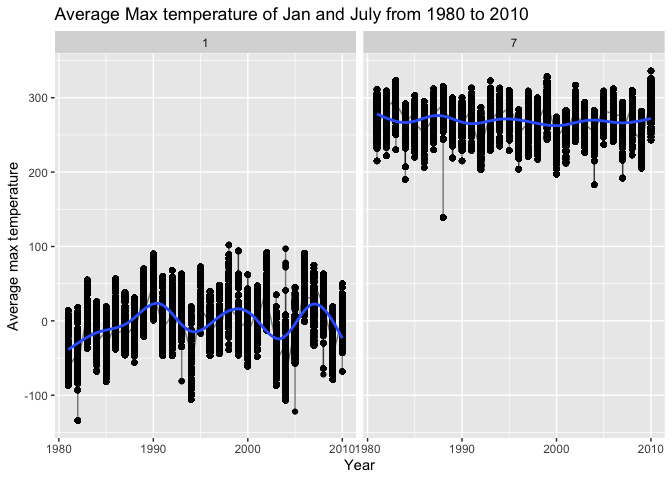

p8105_hw3_jy3186
================
Jiayi Yang
2022-10-11

``` r
library(tidyverse)
```

    ## ── Attaching packages ─────────────────────────────────────── tidyverse 1.3.2 ──
    ## ✔ ggplot2 3.3.6      ✔ purrr   0.3.4 
    ## ✔ tibble  3.1.8      ✔ dplyr   1.0.10
    ## ✔ tidyr   1.2.0      ✔ stringr 1.4.1 
    ## ✔ readr   2.1.2      ✔ forcats 0.5.2 
    ## ── Conflicts ────────────────────────────────────────── tidyverse_conflicts() ──
    ## ✖ dplyr::filter() masks stats::filter()
    ## ✖ dplyr::lag()    masks stats::lag()

``` r
library(dplyr)
library(rnoaa)
```

    ## Registered S3 method overwritten by 'hoardr':
    ##   method           from
    ##   print.cache_info httr

\##Problem 2 load and tidy the data

``` r
accel_data = read_csv("./accel_data.csv") %>% 
  janitor::clean_names() %>% 
  mutate(
    weekday_weekend = ifelse(day %in% c("Saturday","Sunday"), "Weekend", "Weekday"),
    day_id = as.integer(day_id),
    week = as.integer(week)
  ) %>% 
  relocate(weekday_weekend)
```

    ## Rows: 35 Columns: 1443
    ## ── Column specification ────────────────────────────────────────────────────────
    ## Delimiter: ","
    ## chr    (1): day
    ## dbl (1442): week, day_id, activity.1, activity.2, activity.3, activity.4, ac...
    ## 
    ## ℹ Use `spec()` to retrieve the full column specification for this data.
    ## ℹ Specify the column types or set `show_col_types = FALSE` to quiet this message.

``` r
accel_data
```

    ## # A tibble: 35 × 1,444
    ##    weekday_…¹  week day_id day   activ…² activ…³ activ…⁴ activ…⁵ activ…⁶ activ…⁷
    ##    <chr>      <int>  <int> <chr>   <dbl>   <dbl>   <dbl>   <dbl>   <dbl>   <dbl>
    ##  1 Weekday        1      1 Frid…    88.4    82.2    64.4    70.0    75.0    66.3
    ##  2 Weekday        1      2 Mond…     1       1       1       1       1       1  
    ##  3 Weekend        1      3 Satu…     1       1       1       1       1       1  
    ##  4 Weekend        1      4 Sund…     1       1       1       1       1       1  
    ##  5 Weekday        1      5 Thur…    47.4    48.8    46.9    35.8    49.0    44.8
    ##  6 Weekday        1      6 Tues…    64.8    59.5    73.7    45.7    42.4    58.4
    ##  7 Weekday        1      7 Wedn…    71.1   103.     68.5    45.4    37.8    18.3
    ##  8 Weekday        2      8 Frid…   675     542    1010     779     509     106  
    ##  9 Weekday        2      9 Mond…   291     335     393     335     263     675  
    ## 10 Weekend        2     10 Satu…    64      11       1       1       1       1  
    ## # … with 25 more rows, 1,434 more variables: activity_7 <dbl>,
    ## #   activity_8 <dbl>, activity_9 <dbl>, activity_10 <dbl>, activity_11 <dbl>,
    ## #   activity_12 <dbl>, activity_13 <dbl>, activity_14 <dbl>, activity_15 <dbl>,
    ## #   activity_16 <dbl>, activity_17 <dbl>, activity_18 <dbl>, activity_19 <dbl>,
    ## #   activity_20 <dbl>, activity_21 <dbl>, activity_22 <dbl>, activity_23 <dbl>,
    ## #   activity_24 <dbl>, activity_25 <dbl>, activity_26 <dbl>, activity_27 <dbl>,
    ## #   activity_28 <dbl>, activity_29 <dbl>, activity_30 <dbl>, …

There are 35 observations and 1444 variables. There are four date
variables `weekday_weekend`, `week`, `day_id` and `day`; and 1440
variables of activity observations.

aggregate activities and make a plot to show the trend

``` r
accel_data %>% 
  group_by(day_id) %>% 
  mutate(
    activity_total =  sum(across(activity_1:activity_1440), na.rm = TRUE),
    activity_total = as.integer(activity_total)
  ) %>% 
  select(week, day, day_id, activity_total) %>% 
  ggplot(aes(x = day_id, y = activity_total, color = day)) + 
    geom_point() + geom_line() + 
    theme(legend.position = "bottom")
```

<!-- -->
Make a single-panel plot that shows the 24-hour activity time courses
for each day

``` r
accel_eachday = accel_data %>% 
  select(day_id, day, week, activity_1:activity_1440) %>% 
  pivot_longer(activity_1:activity_1440, names_to = "activity_min", values_to = "activity_value") %>% 
  separate(activity_min, c( NA, "activity"), sep = "_") %>% 
  mutate(
    activity = as.integer(activity)
  ) %>% 
  ggplot(aes(x = activity, y = activity_value, color = day), se = FALSE) + 
    geom_point() + geom_line(alpha = .5) + geom_smooth(aes(group = day), se = FALSE) +
    labs(
    title = "24-hour activity plot for each day",
    x = "minute",
    y = "activity value at the minute"
  ) + 
    theme(legend.position = "bottom")
accel_eachday
```

    ## `geom_smooth()` using method = 'gam' and formula 'y ~ s(x, bs = "cs")'

<!-- -->
\##Problem 3 load data from web

``` r
library(p8105.datasets)
data("ny_noaa")
ny_noaa_df = 
  ny_noaa %>%
    janitor::clean_names() %>% 
  drop_na(tmax, tmin)%>% 
 mutate(
    tmax = as.integer(tmax),
    tmin = as.integer(tmin)
  ) %>% 
  separate(date, into = c("year", "month", "day"), sep = "-") %>% 
  mutate(
    year = as.integer(year),
    month = as.integer(month),
    day = as.integer(day)
  )
ny_noaa_df
```

    ## # A tibble: 1,458,900 × 9
    ##    id           year month   day  prcp  snow  snwd  tmax  tmin
    ##    <chr>       <int> <int> <int> <int> <int> <int> <int> <int>
    ##  1 USC00300023  1981     1     3     0     0     0  -122  -206
    ##  2 USC00300023  1981     1     5     0     0     0   -56  -178
    ##  3 USC00300023  1981     1    12     0     0     0  -122  -306
    ##  4 USC00300023  1981     1    13     0     0     0   -67  -289
    ##  5 USC00300023  1981     1    15     0     0     0   -50  -106
    ##  6 USC00300023  1981     1    17     0     0     0   -11  -150
    ##  7 USC00300023  1981     1    20     0     0     0    61   -67
    ##  8 USC00300023  1981     1    21     0     0     0    17  -106
    ##  9 USC00300023  1981     1    22     0     0     0     6   -50
    ## 10 USC00300023  1981     1    23   117   127    76    22   -44
    ## # … with 1,458,890 more rows

count snowfall

``` r
ny_noaa_df %>% 
  count(snow, na.rm = TRUE) %>% 
  arrange(desc(n))
```

    ## # A tibble: 252 × 3
    ##     snow na.rm       n
    ##    <int> <lgl>   <int>
    ##  1     0 TRUE  1167149
    ##  2    NA TRUE   172332
    ##  3    25 TRUE    17542
    ##  4    13 TRUE    13704
    ##  5    51 TRUE    10352
    ##  6     5 TRUE     5960
    ##  7    76 TRUE     5894
    ##  8     8 TRUE     5777
    ##  9     3 TRUE     5614
    ## 10    38 TRUE     5578
    ## # … with 242 more rows

The most observed snowfall value is 0 with a 1167149 frequency of
happening. Because there is usually no snow in most days of a year.

### January and July average max temperature

``` r
Jan_July_df = ny_noaa_df %>% 
  filter(month == 1 | month == 7) %>% 
  group_by(id, month, year) %>% 
  mutate(tmax_mean = mean(tmax, na.rm = TRUE),
         tmax_mean = as.integer(tmax_mean)) %>% 
  summarize(tmax_mean)

Jan_July_df
```

    ## # A tibble: 246,809 × 4
    ## # Groups:   id, month, year [8,141]
    ##    id          month  year tmax_mean
    ##    <chr>       <int> <int>     <int>
    ##  1 USC00300023     1  1981       -21
    ##  2 USC00300023     1  1981       -21
    ##  3 USC00300023     1  1981       -21
    ##  4 USC00300023     1  1981       -21
    ##  5 USC00300023     1  1981       -21
    ##  6 USC00300023     1  1981       -21
    ##  7 USC00300023     1  1981       -21
    ##  8 USC00300023     1  1981       -21
    ##  9 USC00300023     1  1981       -21
    ## 10 USC00300023     1  1981       -21
    ## # … with 246,799 more rows

``` r
ggplot(Jan_July_df, aes(x = year, y = tmax_mean), color = month) +
 geom_point() + geom_line(alpha = .5) + geom_smooth(aes(group = month), se = FALSE) +
  labs(
    title = "Average Max temperature of Jan and July from 1980 to 2010",
    x = "Year",
    y = "Average max temperature"
  ) + 
    theme(legend.position = "bottom") +
  facet_grid(. ~month)
```

<!-- -->
There are several outliers in both January and July average max
temperatures. The observable structure for Janurary is wavy and for July
is more toward a line (more linear).

### Make a two-panel plot showing (i) tmax vs tmin for the full dataset (note that a scatterplot may not be the best option);

``` r
tmax_vs_tmin = 
  ny_noaa_df %>% 
  drop_na(tmax, tmin) %>% 
  select(id, year, month, day, tmax, tmin)
 

tmax_vs_tmin
```

    ## # A tibble: 1,458,900 × 6
    ##    id           year month   day  tmax  tmin
    ##    <chr>       <int> <int> <int> <int> <int>
    ##  1 USC00300023  1981     1     3  -122  -206
    ##  2 USC00300023  1981     1     5   -56  -178
    ##  3 USC00300023  1981     1    12  -122  -306
    ##  4 USC00300023  1981     1    13   -67  -289
    ##  5 USC00300023  1981     1    15   -50  -106
    ##  6 USC00300023  1981     1    17   -11  -150
    ##  7 USC00300023  1981     1    20    61   -67
    ##  8 USC00300023  1981     1    21    17  -106
    ##  9 USC00300023  1981     1    22     6   -50
    ## 10 USC00300023  1981     1    23    22   -44
    ## # … with 1,458,890 more rows
